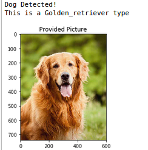
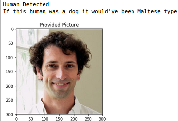
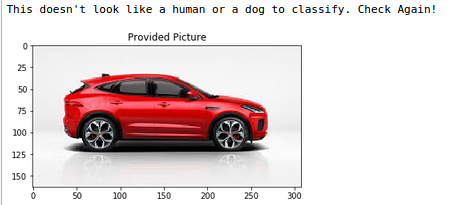

# Dog-Breed-Classifier
This repo contains the submission of DSND Capstone project (Tested on Ubuntu 16.04 LTS and Python 3.x)

## Getting Started
The network provided is used to classify among different dog breeds using Keras API.


Not only this! If a human photo is provided, this network is capable of telling us which breed is close to this human, here are some insights about what's coming ahead!

Detecting dogs:



Detecting humans-alike breeds:




Tricking the network:




## Prerequisites
In order to run this project locally on your machine, you should've the following

- [pip](https://www.tecmint.com/install-pip-in-linux/)
- [numpy](https://docs.scipy.org/doc/numpy/user/install.html)
- [matplotlib](https://matplotlib.org/3.1.1/users/installing.html)
- [Opencv](https://docs.opencv.org/master/d7/d9f/tutorial_linux_install.html)
- [Scikit-Learn](https://scikit-learn.org/stable/install.html)
- [Keras](https://keras.io/#installation)

## Installation
Let's start first with installing the required libraries:

<code>python -m pip install --user numpy matplotlib opencv-python scikit-learn keras</code>

For more installation options for Windows/Mac check the hyperlinks provided in the previous section.

Dataset is available on kaggle [here](https://www.kaggle.com/c/dog-breed-identification/data)


### Running the installation tests

If all the libraries are installed correctly open terminal (ctrl + alt + t) or any Python editor of your choice,
in case you used terminal type <code>python3</code> then type in the following code, it should get executed with no errors:

```python
import numpy
import keras
import matplotlib
import cv2
import sklearn
```

## How the code works

This notebook is broken into separate steps. 
- Step 0: Import Datasets
- Step 1: Detect Humans
- Step 2: Detect Dogs
- Step 3: Create a CNN to Classify Dog Breeds (from Scratch)
- Step 4: Use a CNN to Classify Dog Breeds (using Transfer Learning)
- Step 5: Create a CNN to Classify Dog Breeds (using Transfer Learning)
- Step 6: Write your Algorithm
- Step 7: Test Your Algorithm

## Dataset
Dataset is available on kaggle [here](https://www.kaggle.com/c/dog-breed-identification/data)

## Summary
Using deep learning we knew that each human is sharing some visual features with a certain dog breed.

Check out this Blog on Medium [here](https://medium.com/@abdelrahman.aemam96/dog-breed-classification-with-deep-learning-in-simple-english-and-minimal-code-85448157ad31)

## Acknowledgements
- [Data Science Nanodegree on Udacity](https://www.udacity.com/course/data-scientist-nanodegree--nd025)
